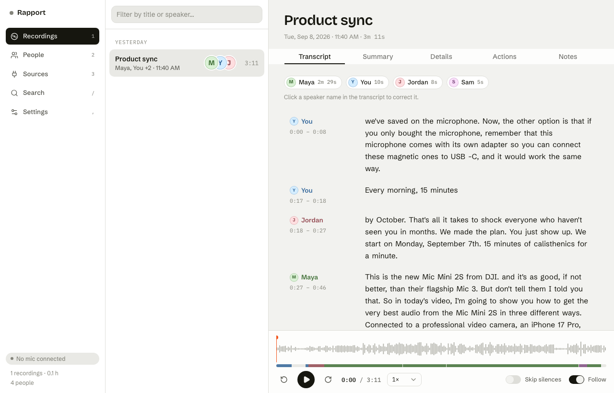
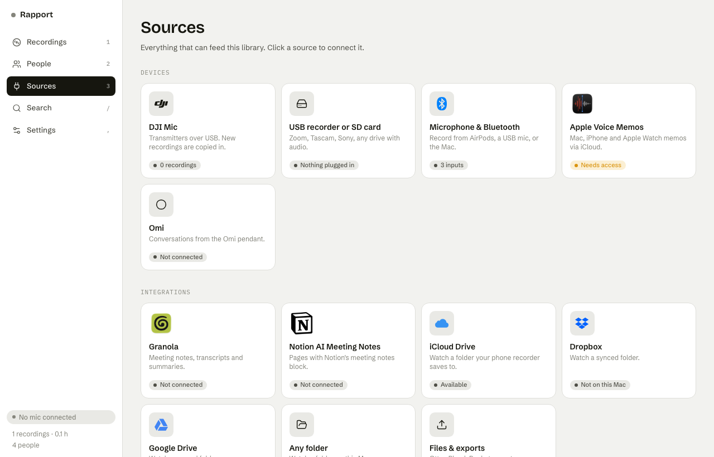
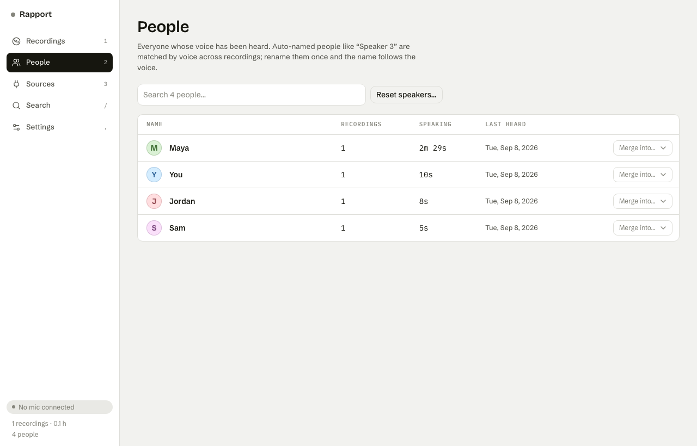

# Rapport

**Every voice note and meeting you record, in one library on your Mac.** Rapport imports from the
devices and apps you already use (iPhone Voice Memos, AirPods, DJI Mic, any USB recorder, Granola,
Notion, Omi, iCloud Drive…), transcribes on-device with Whisper, works out who said what across all
your recordings, writes summaries with a local model, and makes everything searchable.
Nothing is uploaded. No account. No subscription. MIT licensed.

> The best device for recording notes is the one you already have.

- **Local AI note taker for macOS.** Transcription, speaker recognition and summaries run on Apple silicon
  with open models (Whisper via MLX, WeSpeaker voice embeddings, Ollama or MLX LLMs). Your audio never leaves the machine.
- **One library for every recorder.** DJI Mic transmitters, Zoom/Tascam/Sony recorders and SD cards, the Mac's
  microphone, AirPods and any Bluetooth mic, Apple Voice Memos synced from iPhone and Apple Watch, the Omi pendant,
  plus transcripts from Granola and Notion AI Meeting Notes.
- **Knows who's talking, across recordings.** Every voice gets a fingerprint. Name a person once and every future
  recording with that voice carries the name. Fix mistakes in place: rename, reassign, split or merge turns.
- **Search everything you ever said or heard.** Full-text search across all transcripts opens the recording at that second.
- **Summaries with your own model.** Ollama if it's running, otherwise a small MLX model downloaded once. No API keys.
- **Plain files you can see.** Originals, transcripts, people and settings live in one folder you can back up or delete.



<p align="center"> </p>

## Install

**Download the Mac app** from [Releases](https://github.com/Nirmaypanchal/rapport/releases) (macOS 14+, Apple silicon),
open `Rapport.app`, and plug in a recorder or drop an audio file on the Recordings list. Models download on first use
(about 2 GB). The build is unsigned for now, so on first launch right-click the app and choose Open.

**Or run from source** (needs [uv](https://docs.astral.sh/uv/), ffmpeg and Node 20+):

```bash
brew install uv ffmpeg node
git clone https://github.com/Nirmaypanchal/rapport && cd rapport
./run.sh          # opens http://127.0.0.1:8765
```

Full instructions, including the desktop build: [docs/getting-started.md](docs/getting-started.md).

## What it does with a recording

1. **Import.** New files are copied into the library and verified byte-for-byte. Duplicates are skipped by hash.
   Devices are never written to unless you turn on "clear the mic after import".
2. **Transcribe.** Whisper large-v3-turbo on MLX, with word-level timestamps, in 100+ languages.
   A 3-minute recording takes about a minute on an M1 Pro.
3. **Find the speakers.** Voice activity detection, voice embeddings and clustering give you who spoke when.
   pyannote's diarization pipeline is used automatically if you've accepted its Hugging Face terms.
4. **Recognize people.** Each speaker's voice fingerprint is compared with everyone heard before.
   Matches get the name; new voices become "Speaker N" until you name them.
5. **Summarize.** Summary, key points, action items and quotes, from a model on your Mac.
6. **Browse.** Waveform with a speaker lane, transcript with live word highlight, skip silences, export.

Details: [docs/how-it-works.md](docs/how-it-works.md).

## Works with

| Devices | Apps and services |
|---|---|
| Apple Voice Memos (Mac, iPhone, Apple Watch via iCloud) | Granola |
| AirPods and any Bluetooth or USB microphone | Notion AI Meeting Notes |
| iPhone as a microphone via Continuity | Omi pendant |
| DJI Mic Mini, Mic 2, Mic 3 and other USB-mounted recorders | iCloud Drive, Dropbox, Google Drive folders |
| Zoom, Tascam, Sony recorders and SD cards | Otter, Plaud, Pocket and other exports (drop the files) |

Missing yours? [Open a device request](https://github.com/Nirmaypanchal/rapport/issues/new?template=device_request.md)
or add a connector: [docs/developers.md](docs/developers.md).

## Documentation

- [Getting started](docs/getting-started.md): install, first import, permissions (Voice Memos, microphone)
- [How it works](docs/how-it-works.md): the pipeline, the models, what runs where
- [Devices](docs/devices.md): every recorder we know about and how it connects
- [Integrations](docs/integrations.md): Granola, Notion, Omi, cloud folders, exports
- [Use cases](docs/use-cases.md): interviews, user research, lectures, coaching, sales, field notes, journaling
- [Compared to Otter, Fireflies, Granola, MacWhisper, Plaud](docs/comparison.md)
- [Privacy](docs/privacy.md): exactly what touches the network, and what doesn't
- [FAQ](docs/faq.md) and [Troubleshooting](docs/troubleshooting.md)
- [For developers](docs/developers.md): architecture, API, adding sources and summarizers, desktop build
- [Roadmap](docs/roadmap.md): people memory, MCP server, ask-your-library

## Why open source

Your conversations are the most personal data you have. The only way to trust a tool with them is to be able to
read it, run it yourself, and keep it working forever. Rapport is MIT licensed; use it, fork it, build on it.
If you make something with it, tell us in [Discussions](https://github.com/Nirmaypanchal/rapport/discussions).

## Contributing

See [CONTRIBUTING.md](CONTRIBUTING.md). Good first contributions: a device you own that doesn't import yet,
a summary template, a language you speak, a doc page that confused you.

## License

[MIT](LICENSE). Models are downloaded from their own sources under their own licenses (Whisper and pyannote: MIT;
WeSpeaker and Qwen: Apache-2.0; Silero VAD: MIT).
